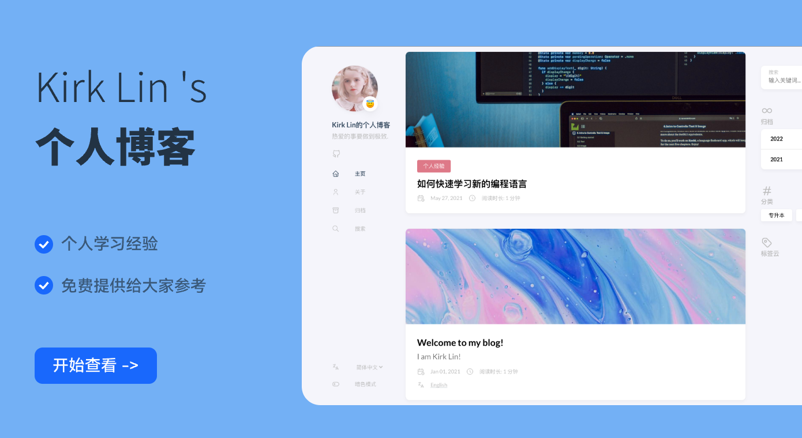

# Kirk Lin 's blog
分享个人学习经验以及日常生活的地方
 
# Site
- [netlify备用站](https://kirklin.netlify.app/)
  
- [kirklin.cn](https://kirklin.cn)

# License
本博客内容采用 [Creative Commons Attribution-NonCommercial-NoDerivatives 4.0 International License](http://creativecommons.org/licenses/by-nc-nd/4.0/) 进行许可。

