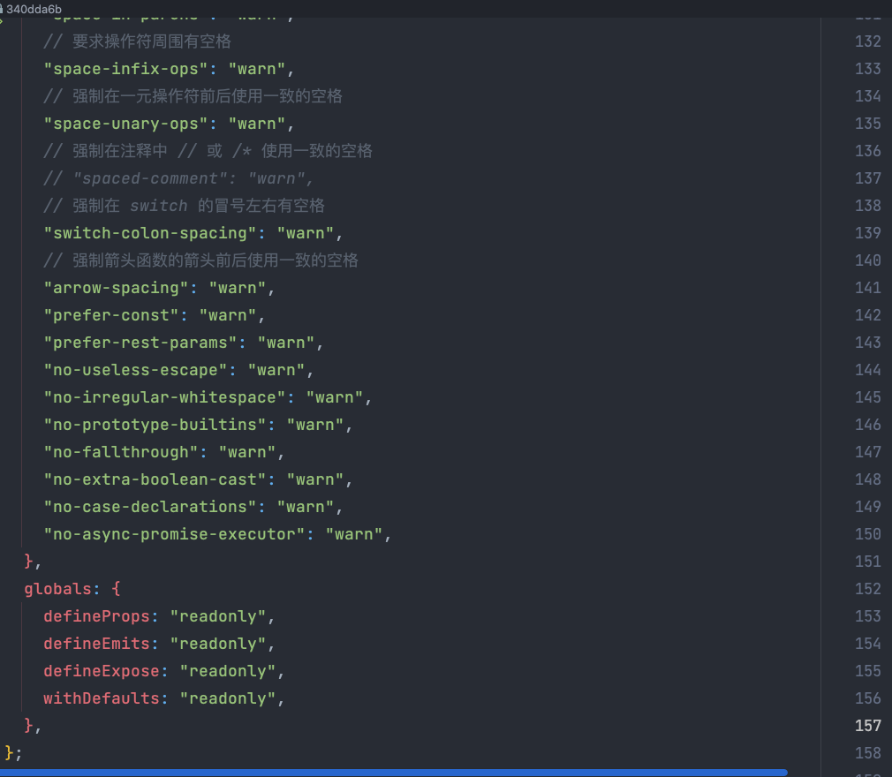
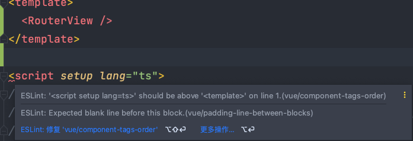

## 为什么会有ESLint的出现

*离娄之明，公输子之巧，不以规矩，不能成方圆。——孟子《离娄上》*

在前端工程化中。统一项目中的编码规范是必不可少的环节。每个人都有自己的编码风格，但是这会在项目管理中带来不必要的麻烦。为了避免代码质量参差不齐，提升代码的可维护性与阅读性。ESLint，Prettier等自动化检查工具就诞生了。

## ESLint以及Prettier的配置繁琐之处。

```bash
pnpm i -D eslint eslint-plugin-vue @typescript-eslint/parser @typescript-eslint/eslint-plugin prettier eslint-config-prettier eslint-plugin-prettier
```

每当创建一个新项目的时候，需要很多步骤重新进行配置Eslint, Prettier ，可能光Eslint的config和plugin就得装7,8个。更别说加上Prettier后，由于它们之间有一些功能重叠，还得解决一手Eslint和Prettier的冲突。光装依赖还不够，您还得配置Eslint规则呀，又得花时间整理，可以说是很难受了。



## ESLint以及Prettier一定要一起使用吗？

Prettier 作为代码格式化程序，只关心代码风格而完全不关心代码逻辑，而代码逻辑正是ESLint的重点，它能帮助我们发现很多低级的Bug。因此，我们常常能看到

使用了 Prettier 的项目也使用 ESLint 来检查代码逻辑。那反过来说，仅仅使用ESLint能不能进行很好的代码格式化呢？答案是肯定的。那我们为什么不能只使用ESLint进行一锅端呢？

在接触了Anthony Fu大佬的开源项目后，我直呼Elegant，大佬的```ESLint配置文件```仅有短短三行并且没有使用Prettier。既解决了ESLint配置繁琐的问题，又搞定了ESLint与Prettier冲突的问题（毕竟Prettier都没用，从源头上解决问题）。这就是我想要的。于是基于大佬的项目[@antfu/eslint-config(github.com)](https://github.com/antfu/eslint-config)，结合官方文档，我们来造个轮子：[@kirklin/eslint-config (github.com)](https://github.com/kirklin/eslint-config)，做一个属于自己的ESLint-config package。


## eslintrc.json 仅有三行的秘密

```json
{
  "extends": "@kirklin"
}
```

其实连三行都算不上，应该算1行。秘密一定是从extends 这个字段开始的。

extends 的功能其实很单纯，就是把其他开发者写好的 eslint-config（ESLint 配置文件）给加载进来。例如eslint-config-standard、eslint-config-airbnb、eslint-config-prettier、以及我们造的轮子 @kirklin/eslint-config 。

那么问题一下子就清晰了。如何开发一个这样的ESLint-config呢，继续翻阅官方文档，在开发指南下有一个Shareable Configs的文档，介绍如下

> The configuration that you have in your file is an important part of your project, and as such, you may want to share it with other projects or people. Shareable configs allow you to publish your configuration settings on [npm](https://www.npmjs.com/) and have others download and use it in their ESLint projects.`.eslintrc`

翻译过来就是： 包含配置信息的 `.eslintrc` 文件是你的项目中重要的部分，正因为这样，你可能想要将你的配置信息分享给其他项目或人。可分享的配置允许你在 [npm](https://www.npmjs.com/) 发布你的配置设置并且其他人可以在他的 ESLint 项目中下载使用这些配置。

所以我们造一个自己的Shareable Configs就可以达到同样的效果了。

## @kirklin/eslint-config源码解读

找到路径`packages/all` ,阅读源码当然先从 `package.json`开始看

```typescript
// package.json精简如下。
{
  "name": "@kirklin/eslint-config",
  "description": "Kirk Lin's ESLint config",
  "homepage": "https://github.com/kirklin/eslint-config",
  "main": "index.js",
  "files": [
    "index.js"
  ],
  "peerDependencies": {
    "eslint": ">=7.4.0"
  },
  "dependencies": {
    "@kirklin/eslint-config-vue": "workspace:*",
    "@typescript-eslint/eslint-plugin": "^5.36.1",
    "@typescript-eslint/parser": "^5.36.1",
    "eslint-plugin-eslint-comments": "^3.2.0",
    "eslint-plugin-html": "^7.1.0",
    "eslint-plugin-import": "^2.26.0",
    "eslint-plugin-jsonc": "^2.4.0",
    "eslint-plugin-n": "^15.2.5",
    "eslint-plugin-promise": "^6.0.1",
    "eslint-plugin-unicorn": "^43.0.2",
    "eslint-plugin-vue": "^9.4.0",
    "eslint-plugin-yml": "^1.1.0",
    "jsonc-eslint-parser": "^2.1.0",
    "yaml-eslint-parser": "^1.1.0"
  },
  "devDependencies": {
    "eslint": "^8.23.0"
  }
}
```

首先package.json与正常的node.js模块没什么区别，但是根据官方文档介绍，模块名称必须以 `eslint-config-` 开头，例如 `eslint-config-kirklin`。

或者是npm [scoped modules](https://docs.npmjs.com/misc/scope) 的形式，以 `@scope/eslint-config` 前缀命名，比如 `@kirklin/eslint-config` 。这么命名到时候可以方便我们使用ESLint配置

 [peerDependencies](https://docs.npmjs.com/files/package.json#peerdependencies) 字段声明了依赖的 ESLint版本最低要求为7.4.0 并且向后兼容。

接下来打开index.js文件

```typescript
// packages/all/index.js
module.exports = {
  extends: [
    "@kirklin/eslint-config-vue",
  ],
};
```

代码很短，但是根据前面学习到的知识依然找到了extends，我们知道这是一个套娃写法。不断溯源，最后我们找到了`packages/basic/index.js`

```json
// packages/basic/index.js 精简如下

module.exports = {
  env: {
    es6: true,
    browser: true,
    node: true,
  },
  reportUnusedDisableDirectives: true,
  extends: [
    "./standard",
  ],
  ignorePatterns: [
    "*.min.*",
    "*.d.ts",
    "CHANGELOG.md",
    "dist",
    "LICENSE*",
    "output",
    "coverage",
    "public",
    "temp",
    "package-lock.json",
    "pnpm-lock.yaml",
    "yarn.lock",
    "__snapshots__",
    "!.github",
    "!.vitepress",
    "!.vscode",
  ],
  plugins: [
    "html",
    "unicorn",
    "kirklin",
  ],
  settings: {
    "import/resolver": {
      node: { extensions: [".js", ".mjs"] },
    },
  },
  overrides: [
    {
      files: ["*.json", "*.json5"],
      parser: "jsonc-eslint-parser",
      rules: {
      },
    },
    {
      files: ["*.yaml", "*.yml"],
      parser: "yaml-eslint-parser",
      rules: {
      },
    },
    {
      files: ["package.json"],
      parser: "jsonc-eslint-parser",
      rules: {
      },
    },
    {
      files: ["*.d.ts"],
      rules: {
        "import/no-duplicates": "off",
      },
    },
    {
      files: ["*.js"],
      rules: {
        "@typescript-eslint/no-var-requires": "off",
      },
    },
    {
      files: ["scripts/**/*.*", "cli.*"],
      rules: {
        "no-console": "off",
      },
    },
    {
      files: ["*.test.ts", "*.test.js", "*.spec.ts", "*.spec.js"],
      rules: {
        "no-unused-expressions": "off",
      },
    },
    {
      // Code blocks in markdown file
      files: ["**/*.md/*.*"],
      rules: {
      },
    },
  ],
  rules: {
  },
};
```

其中包含了一下配置项：

- `env`：让 ESLint 知道那些是原本就存在项目中的全局变量（global variable），否则当你在项目中直接使用了这些全局变量却又没有定义的话，ESLint 就会认为这个变量不存在而报错`
- `globals`：可以定义全局中的变量的权限（只读，可读可写）
- `parserOptions`：告诉 ESLint 项目中所使用的 JavaScript 语法版本。
- `rules`：经过这个字段设置，可以让 ESLint 知道当不同的规则触发时，ESLint 要用什么类型的方式给予提示，是要当成是 error、warning、或是不用理会。 例如，在这里可以设定，假如代码尾不加分号，要当成是严重的错误（error），出现警告的提示（warning）就好，或是可以完全不用理会这个情况（off）。
- `plugins`：是一系列由其他开发者撰写好的规则，让使用的人可以把这些规则加载到 ESLint 中使用，但要留意的是：「**它只是定义好的规则，并没有说明要如何使用这些规则**」，也就是说，plugin 只会载入规则，但不会说明这些规则发生时到底要被 ESLint 判断成是 error、warning、还是可以不用理会
- `ignorePatterns`：告诉 ESLint 忽略对这些配置的文件进行代码检查，这也是为什么我们可以不用额外创建.eslintignore的原因
-  `overrides`： 可以为某个文件或者某组文件进行覆盖配置

而我们发现最基础的/basic/index.js 下继续extends了一个文件`standard.js`。这便是整个项目遵循的主要的ESLint风格 -> JavaScript Standard Style (standardjs.com)](https://standardjs.com/)。我们在造自己轮子的时候也可以替换成常见的Airbnb,Google等自己喜欢的基础风格。


## 如何使用 ESLint Shareable Configs

例如我们造的轮子，是npm scoped modules命名的 

那么我们可以通过使用模块名：

```
{
    "extends": "@kirklin/eslint-config"
}
```

或者你也可以省略 `eslint-config`，ESLint 会自动处理：

```
{
    "extends": "@kirklin"
}
```


## 定制Rules小技巧

一条一条对着文档查看Rules规则配置肯定十分劳累，我们可以通过一个小技巧，在准备定制ESlint配置的时候，可以先将自动修复关闭，这样子可以方便的查看是哪条Rules引起了警告⚠️或者错误❎。接着去官方文档上查询对应Rules即可。

例如在打开Vue项目的时候，使用我们造的轮子就会将VUE中template，scripts的顺序进行调整，这个时候可以发现顺序不对报错的规则对应的名字是`vue/component-tags-order` 。我们就可以查询文档定制这条规则。将顺序变成template，script，style。



```json
"vue/component-tags-order": ["error", {
      "order": ["template", "script", "style"]
    }]
```


## 参考资料

https://eslint.org/docs/developer-guide/shareable-configs

[Why I don't use Prettier (antfu.me)](https://antfu.me/posts/why-not-prettier)

[@antfu/eslint-config: Anthony's ESLint config presets (github.com)](https://github.com/antfu/eslint-config)

[@kirklin/eslint-config: Kirk Lin's ESLint config presets (github.com)](https://github.com/kirklin/eslint-config)

