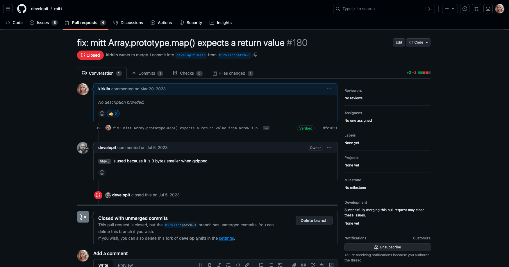

故事是这样的，半年前我提交了一个 Pull Request（PR），想要将作者在代码中使用的 `map` 改成 `forEach`，

而作者的回应却是：`map() is used because it is 3 bytes smaller when gzipped.` （使用 `map` 是因为在 Gzip 压缩时可以减小 3 字节的体积。）

咦？为什么会这样呢？

## "mitt" 简介

首先，让我们认识一下 "mitt"，它是一只小巧灵活的事件发射器（event emitter）库，体积仅有 200 字节，但功能强大。这个小家伙在项目中充当了事件的传播者，有点像是一个小型的邮差，把消息传递给需要它的地方。

[developit/mitt: 🥊 Tiny 200 byte functional event emitter / pubsub. (github.com)](https://github.com/developit/mitt)

## 作者的选择：`map` vs `forEach`

在源码中，我们发现作者选择使用了 `Array.prototype.map()`，这是一个处理数组每个元素并返回新数组的函数。然而，有趣的地方在于，作者并没有在 `map` 中返回任何值。这和我对 `map` 的期望有些出入，因为我们习惯于用它生成一个新的数组。

**代码的细微变化**

曾经，代码片段是这样的，作者想要用 `map` 来执行一些操作，但却不生成新数组。

```js
if (handlers) {
  (handlers as EventHandlerList<Events[keyof Events]>)
    .slice()
    .map((handler) => {
      handler(evt!);
    });
}
```

我希望修改成这样：

```js
if (handlers) {
  (handlers as EventHandlerList<Events[keyof Events]>)
    .slice()
    .forEach((handler) => {
      handler(evt!);
    });
}
```

所以我很快就交了个PR：将map改成了forEach，经过了几个月的等待，PR被拒了，作者的回应是：`map() is used because it is 3 bytes smaller when gzipped.`（使用 `map` 是因为在 Gzip 压缩时可以减小 3 字节的体积。）



## 小技巧背后的逻辑

虽然 `map` 通常用于生成新数组，但作者在这里使用它更像是在借助压缩的优势，让代码更轻量。

**大小对比**

通过实验验证，使用 map 的打包大小确实稍微小一些：

- 使用 `map` 时，打包大小为：
```
  - 190 B: mitt.js.gz
  - 162 B: mitt.js.br
  - 189 B: mitt.mjs.gz
  - 160 B: mitt.mjs.br
  - 268 B: mitt.umd.js.gz
  - 228 B: mitt.umd.js.br
```

- 而使用 `forEach` 后，打包大小为：
```
  - 192 B: mitt.js.gz
  - 164 B: mitt.js.br
  - 191 B: mitt.mjs.gz
  - 162 B: mitt.mjs.br
  - 270 B: mitt.umd.js.gz
  - 230 B: mitt.umd.js.br
```

### 进一步实验

为了深入了解选择的影响，我又进行了一个实验。有趣的是，当我将代码中的一处使用 `map` 改为 `forEach`，而另一处保持不变时，结果居然是打包体积更大了。


## 总结

这个故事让我不仅仅关注于代码表面，还开始注重微小选择可能带来的影响。学到了很多平时容易忽略的点，"mitt" 作者的选择展现了在开发中面对权衡时的智慧，通过选择不同的API，以轻松的方式达到减小代码体积的目标。在编写代码时，无处不充满着权衡的乐趣。

如果你对这个故事有更多的想法或者其他技术话题感兴趣，随时和我分享哦！
