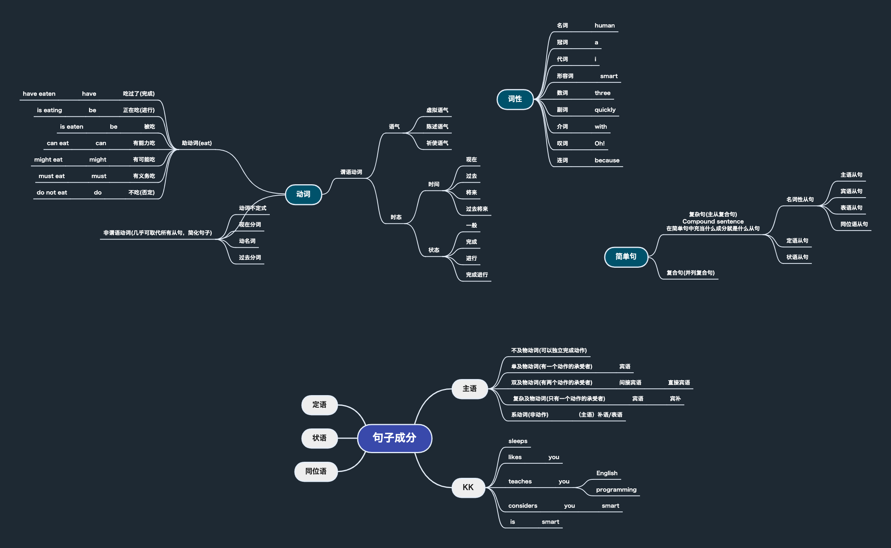

## 前言

思考再三，笔者决定分享其自身的考试经历。本篇文章不同寻常，作者未获心仪学府入选，仍秉持分享其经验与教训之志。作者所写约万字，需耗时一定时间阅读，恳请耐心细读，或自择所感兴趣之处略读。

## 专升本的背景

笔者实则早在大一大二时期，就开始憧憬着专升本之路。当时，笔者怀揣美梦，早已选定武汉纺织大学，然而，机缘不济，该校在笔者大二之时，宣告不再招收计算机专业之专升本生。
经询问老师并考察相关资料，笔者最终决定报考湖北经济学院。当时，笔者仍混迹于各大竞赛，专升本之念亦只是口头一提，偶有心血来潮，稍加数学自学。 笔者并未坚定决心，只是想尝试专升本之路。
直至2022年春夏之际，笔者始领悟，自己从未如此迫切地渴求过专升本。笔者曾幼稚以为，只要履历填满获奖荣誉，轻松参与大厂面试自是绰绰有余。而现实残酷地教导笔者一课，竞争激烈，就连二本生亦难以走入面试大门。焦虑失望之际，笔者终于鼓起勇气，决定尽全力备考专升本。

## 失败的原因    

翻卷而来，方知专升本之路，惨痛艰辛。其中，英语一科，殊出我意料之外，又在情理之中。英语分数低于预期8-10分，大概原因是：一来自己英语不精，最后翻译与作文题的难度提升，难以应对。二来自己平时复习所练只是单选题和阅读题，对于卷后一半的主观题长期忽视，且抱有“大家成绩不会相差太远”的想法。终竟，事与愿违，我认识到我错了。尽管单选题提前对了答案，只有五题答错，但最终翻译部分却状况频发。最终分数只有68分。

随后，是专业课数学之考。高等数学，翻车不已。在考完专业课二（C语言程序设计）的时候，内心已经在欢喜以各种方式考上学校。没想到高数考卷发下来后，我一度怀疑自己看错了考卷。眼前的题目，竟然超出了考纲范围，前所未闻！我瞬间紧张了起来，无数次想举手询问考卷是否有问题，但直觉告诉我，不如先把考卷上会的题目冷静做完。于是，我轻松秒杀了前面学过的内容。思前想后，觉得自己先前何必花时间去学考研数学呢，有这个时间不如把下册的知识点都看完，这样就不怕超纲了。最终，我还是没有勇气去质疑试卷，冷静解决了超纲的题目，便停下了笔。抬头一看时间，还剩下20分钟。然而，我大抵是凉了。竟然还有这么多时间，可见我的命运之丧。

等待考试结果出来，果然，我数学只拿了24分。虽然考纲超了，但的学校教过高等数学或者自学完高数的同学们当然能够应对。这样，我虽有气，却也无从抱怨。

最终，我迎来了专业课三的考试，成功地避开了所有的陷阱。可是，遇到了两道概念题，我犯了难。我看着这些多选题，少选题，都不知道该选哪一个，对着这些概念题呆若木鸡。我明白，我或许已经无法获得这4分了。最后成绩出来了，我发现自己只拿了42分。虽然在计划范围内，但大概是因为我记错了几个运算符的优先级。也怪自己太过自信，选择了几乎裸考的学习方式。如果我认真地多刷几道题，或许46+分应该没问题。总之，我最终的考试分数是68+24+42=134分。我想，湖北经济学院对我来说已经无缘了。尽管我还有很多遗憾，但我也明白自己已经尽力了。技不如人，甘拜下风。之前，有人已经在提醒我这些容易翻车的点。但当我没有亲身经历时，我不愿去相信。这也是我的缺点。

## 失败后得出的经验    

听闻君子之言，必须从容倾听，而后再细细揣摩其中的智慧。论专升本考试，尤其如此。

因为，往往是最微小的细节决定了成功或失败。我不禁想起自己的经历，如今已成为一段失败后的经验。

首先，不要轻信那些所谓的考纲，即便是学校出的考纲，也可能在实际考试中带来意想不到的坑。这一点，无数考生都有深刻的体会，我自己也不例外。因此，尽管有考纲指引，也要心怀警惕，多准备备选方案，才能应对意外情况。

其次，也许更为重要的是，不要贪图刺激、去学习超出自身水平的难题。即便你天资聪颖，也不要被自己的聪明蒙蔽双眼，迷失在知识的海洋中。我曾经犯过这个错误，结果只得到了失望和挫败。因此，建议各位考生，要以真题试卷为准，判断出专升本考试的难度范围，从而合理安排自己的学习计划。

最后，更要警惕的是盲目自信，以为自己已经掌握了所有的知识点，就可以轻松应对考试。实际上，专升本考试中会涉及很多细节和综合能力的考察，往往有些平时容易忽略的知识点也可能成为关键因素。因此，不要骄傲自满，认真复习每一个细节点，注重基础，同时也要不断巩固提高自己的知识水平，才能在考试中取得好成绩。

以上就是我从失败中总结出的经验，希望各位考生引以为戒，珍惜学习机会，以最佳状态迎接考试的挑战。

## 备考学习路线分享   

接下来我分享一下自己的备考路线提供参考，希望可以帮助到还在迷茫的同学。

### 英语

首先我最想分享的是英语，对，英语是我弱项，也是我备考前害怕最无助的科目，可他偏偏是我从小到大的绊脚石，于是下定决心这次一定要把英语拿下，首先在开始专升本考试复习前，本人考过英语四级，我放出我此前的英语水平提供参考，我的2019高考分数72分，四级分数300分整，2020专升本真题模拟卷只拿了50+ 。面对备考时候的无助与迷茫，我还是决定动用了以前学计算机成功的“抽象”思维，先别着急，容我再花点时间解释一下什么是我认为的抽象思维。最近学了人文、哲学相关的课程。我对我的学习方法有了一个更为精确的解释，这有点类似于柏拉图的“理念论”：

> 柏拉图建立起（西方）第一个完整的哲学体系。柏拉图的哲学概括的说就是“理念论”，他不再用宗教的语言说话，不再用原始的宗教语言说话，他带着一种理性的语言。那么理性的语言也要构造出一个“彼岸的世界”来，这个世界叫“理念世界”。这个理念论我不在这里展开，要费很多时间。有一个简单的道理来说明“理念论”的成立。我们要先懂柏拉图。比方说，“什么叫一把锤子？”我们说看到这把锤子的特殊的形态，如此这样的一个锤子的柄和这样一个锤子的头，然后我说这是一把锤子。不，锤子不在于它的这样外部特征，我们认识到“这是一把锤子”，因为我们心中本有了锤子的理念。那么这就是每一把具体的感性的锤子，其实是对锤子理念的分有、模仿。那么大家听到柏拉图的这种理念就觉得很奇怪。每一个感性的事物都是对理念的不完善的模仿。比如说，这匹白马、那匹黑马，都是对“马”这个理念的模仿，当然模仿出来肯定不完善、有缺陷。那么怎么理解这件事情呢？很简单：假如我现在要完成一件任务，假如这是一个木头做的桌子，我要把一个图钉敲到这张桌子上去，通常我使用的那把锤子不在场，但是我还要做成这件事，我就完全可能举起我这块手表，把这个图钉敲到这张桌子上去。这时候，它是手表吗？不，它是锤子。锤子就是这样对人而存在的。这就是理念。所以，锤子之所以为锤子不在它具体的形象，某个物体它一定不像锤子，但我就把它做锤子用了。因为我心中有锤子的理念。这就有一点懂了，什么叫柏拉图的“理念论”。

我们要做的其实就是类似于把当前所学知识提取成“理念论”中的“理念”。由此便能把知识点一层一层的抽象，直到一个抽象的概念。我认为这种学习方法对于我本人来说帮助挺大的。有的书籍也是由这种方式书写的，例如：《计算机网络自顶向下方法》。假设说到这里，你大概有那么一丢丢理解了我所说的方法。我开始分享我的学习路线（零基础适用）。

#### 备考开始准备工作

音标、 英语26个字母读音与写法、记单词的方法【词根词缀法、联想法，构词法等等，找到你喜欢的方法】

#### 备考前半年

在搜索了网上资料后，我决定先开始积累词汇了！在从一开始每天30词开始，慢慢加到后面每天100次，由于很多人都说词汇非常非常重要。所以我在连续2个月时间内不断的背单词，有的时候会产生迷茫。学英语，只有背单词了吗。但是好像不背单词我又看不懂文章的意思。于是就在反反复复的背诵单词。

##### 背单词APP的纠结

我感觉我是一个奇怪的人，总要选一个我认为最厉害的背单词软件。不然仿佛这样子就背不下来单词了。但是我后面发现选一个自己喜欢的背单词软件就好了，市面上的大多数软件都挺好用的。不停切换背单词的软件只会让我花费更多无用的时间。只要选的是艾宾浩斯记忆曲线、“SuperMemo记忆算法”类的单词软件其实都大差不差。我后来甚至因为选不出来好用的单词而自己从头写了一个背单词的APP，简直是浪费时间。

#### 备考前两个月

我在不停背单词的枯燥中厌烦了，但是按网上说的我还应该去学习一下语法，可我当初十分惧怕语法，打心底里的害怕，所以我决定跳过语法，直接做2020真题卷，结果自然很惨烈只拿了50多分。而我当时甚至连题型都不知道，还以为专升本有听力呢。后来在老师和身边朋友的帮助下。首先分析了一下专升本英语真题考试试卷【一定要用真题试卷分析，不要用模拟卷】。我发现湖北省专升本试卷单选题一共25分，其中15分考语法题，而四级考试是不怎么考察语法，而部分理科生对语法可能和我一样，所以我认为这15分的语法题可能就是最后和别人拉开差距的关键。加上我之前不停的在背单词，所以考卷上不认识的词似乎很少。我能很轻松的看懂每个单词，但是我就是看不懂文章中的一整个句子到底是什么意思，正当我觉得：“坏了，这我咋背了单词还是看不懂句子呢？”正当我准备跑回去重新继续背单词的时候【这也是我顿悟后快速提分的关键】，朋友问问，你要考虑一下你的语法是不是有很大问题了，我一想，好像是这个道理，举个例子：有如下中文句子“多亏跑了两步，差点没上上上上海的车”。是不是第一眼也看不出来到底是什么意思，但是这能说明你是汉字看不懂的问题吗，并不是，而是断句没搞好如果我写成：“多亏跑了两步，差点没上上，上，上海的车”那你一定轻松看懂。所以学语法或许也有一点类似的道理，并且英语的语序和我们中文的语序还是不大一样的，我当时不断犯的一个错就是：带着中文的语法去看英语句子，这样子很容易让我陷入困境。学英语一定要用英语的习惯来学。接下来我要介绍我是怎么学语法的

##### 语法基础之框架建立

根据之前提到的学习法，我首先建立了一个上层的学习框架。我认为这样子可以帮我理清楚学习语法的方向，首先我观看了哔哩哔哩上的up主（视频博主）“英语兔”的视频：[一个视频说清整个英语语法体系(重塑你的语法框架)](https://www.bilibili.com/video/BV1r54y1m7gd?spm_id_from=333.337.search-card.all.click&vd_source=a848de2e6ec41fbcb53ca42a0175c2f5)

附上思维导图预览图：

建立起语法框架后，我感觉我就不会一直纠结于大部分的英语疑问了，也帮助我减轻了初中高中学习英语语法的恐惧感。例如我此前就纠结于“什么是谓语？什么是动词？什么是宾语？什么又是名词”这种问题，以前问别人的时候，别人只会回答我告诉我一下部分知识点，比如这是主语，我问词性的时候又说这是主语，我就认为主语等于名词。后面又来一个名词也可以是宾语。多来几个我就开始混乱了。什么一会主语一会宾语一会又名词一会又形容词。但是看完框架视频。我觉得我的思路一下子就清晰了起来。并且也不会受到英语语法翻译成中文后出现的各种奇怪的专业名词。

在学完框架完的时候，我突然有一种我觉得我又行了的想法，转头立马刷了套英语选择题。好！依然是错十几个。我立即明白，我之前的英语基础真的太不好了，仅仅靠框架是不够用的，我连分析简单句中的各种词性以及某个单词/词组在简单句中的句子成分的很吃力。这个时候收到同样备考专升本的朋友的推荐，我开始观看哔哩哔哩上up主：“英语的平行世界”的视频[【易筋经】底层、科学、垂直、颠覆](https://www.bilibili.com/video/BV1J4411B7n8?spm_id_from=333.337.search-card.all.click&vd_source=a848de2e6ec41fbcb53ca42a0175c2f5)  看了几天后，我重新刷了一套专升本阅读题练习。发现确实把视频学习完后，之前很难翻译的句子视乎也有了点思路，也不会像之前那样晕头转向的，。

所以我得出结论，英语的框架建立很重要！不必搞明白每个精细的知识点，现在做的仅仅只是了解一下框架，只要认识到某个东西在整体中的作用就可以。记得学框架以及简单句的同时得继续不断的背单词！背单词！背单词！

#### 备考前的一个月

这个时候我已经积累的2000多个专升本英语词汇了，加上以前吃老本的英语单词，并且对英语语法有一基本的入门。我发现我已经可以到达60分的水平了。在分析了一下做的错题，我发现我虽然学了入门的语法，但是考试的时候对于从句什么的题目依旧是疯狂错，正当我怀疑自己不适合学英语的时候，我认真研究了一下之前up主给的学习地图，我发现这仅仅只是英语语法的开端。精彩的还没有开始学，依然是英语的框架。只是帮助理解了细致一点的框架。我开始没日没夜的刷英语语法。其中我发觉时态语态、从句加强学完后，单选题的语法题分数瞬间多了5-6分，错的大部分都是固定搭配。可是这个时候我似乎没有多少时间去背诵固定搭配了，只能考所谓的“语感”玄学做题，这是比较遗憾的地方。而后续的提分似乎变的十分缓慢。可能花大量的时间最后只能缓慢提升个几分。我再一次觉得我的英语陷入了瓶颈，但是这个时候已经快考试了。我也没有更多的时间继续提高英语了

总结一下，学完基础课后我们还差时态语态、从句加强、虚拟语气、非谓语动词。时态语态我觉得英语兔和平行世界的视频课程都还不错。接下来的从句之类的我是直接全部跟着平行世界学了。

我们不知不觉就贯彻了“自顶向下”的学习路线。先在脑中构建一个英语基础的骨架，然后不断规划一条合理的学习路线，先是让我们能看懂英文单词，接着理解英语文章大概意思，接着抽象出句子的模型，句子又拆成不可再拆的简单句，深入学习简单句。最后回溯一整个流程。将简单句重新汇合成复杂句，复杂句再构成回文章。此时也许已经学习了英语大部分知识点了【对于专升本考试而言】剩下的就是补充细枝末节了。

#### 拿不到高分的反思

由于我自己的英语水平只考到了70-80分左右，所以我并不能给出很好的高分路线，我只能说一下我失分的主要地方，其实做完前面的工作【英语专升本考纲背了2500个，没背完，词组搭配没背过】，我基本上能够看懂一整张考卷。但是由于我并没有去背固定搭配，所以我单选题错的主要在词组搭配，我的语法题最多只错个没学完的非谓语动词，扣分点集中在单选题的固定搭配，最后的翻译题和作文题。阅读偶尔错1个。所以英语想考90+的同学应该要提前开始学习，毕竟技巧的东西就那么多，剩下考高分的全靠积累了。这就是我觉得英语和别的2门专业课不一样的地方。你没有办法短时间的冲刺高分，短时间内只能达到平均分，剩下高分部分只能靠自己汗水的积累。

### 数学

#### 学习经历

数学也是走了弯路，一开始看见考纲还挺开心的，只考高等数学上册，于是开始寻找高数相关的课程，但是奈何很多课程看着似乎都有点困意（别笑！hhh），而专升本考试的资源少之又少。最终尝试了寻找考研数学。不经感叹到考研的学习资源真的多。对比了几个老师。最后选着了张宇。张宇考研基础三十讲一开始就带着复习了一下高中知识。感觉帮助挺大，反复听了2遍高中数学复习课之后，开始了高等数学的学习。但是我不知道张宇的课程不太适合一点高数的同学听，但是汤老师上课带点口音又有点难听懂。只好硬着头皮往下听了。熬过了“极限”，微分又给我心态搞崩了。反反复复听了3,4遍（这个时候我还不知道去换课程，真的有点失误），终于又是把微分搞定了。没想到中值定理又让我怀疑人生，但是我想起来湖北经济似乎只考选择题，中值定理或许不会出题呢。抱着这种心态，我直接跳到了积分。好，积分彻底听不下去了。终于准备换课程了。把目光放到了b站上播放最多的高数老师：宋浩老师，刚好宋老师出了专升本专课。和小伙伴拼课之后拿下了课程，一直追了几个月，总算是教到积分了。这次终于听懂了。但是回顾一整个课程，对比考研视频，总觉得又少了什么。拿起人手一本的小红书（库克高数1000题/2000题），做了一遍选择题，发现很多难一点的题目就不太会了，转不过弯来。本着还是对数学有点不放心，于是最后考试延期的时候又选择了回去听考研数学。这次不是张宇，换成了汤老师（汤家凤）的高数课。发现汤老师讲的基础课，真的不会一知半解。在看完了汤老师的课之后，我才顿悟过来，初学者就应该脚踏实地，网上说的张宇偏难一点，意思不是让你学了就可以做难题，实际含义是，张宇偏重技巧性，适合高数有一定基础的同学。但是汤老师的基础课，就真的是基础课。我瞬间感觉之前的时间白花了。（我这里是以没上过高数的同学的视角的真实感受，后来我感觉我坚持选择考高等数学的学校也有张老师的一份功劳）。我回过头来重新做了一遍库克。终于，没有一题没思路。我露出了满意的笑容

#### 总结

如果你高数没学过，我建议你宋浩老师和汤老师选一个，如果你时间多，闲的没事干。我建议你宋浩的专升本真题和汤老师的考研基础课全部刷一遍。

### C语言程序设计

推荐课程中国MOOC上的哈工大的课：《C语言程序设计精髓》，别的不说，推了N次了。学完感觉对我计算机基础打下了牢不可靠的根基，看10遍都不过分。别再死磕“谭浩强”的书了！！！学完顺带把课后作业做完。啥C语言考试都不慌。

## 备考时间分配参考

如果你很幸运，很早就看见了我这篇文章，那我恭喜你。首先我认为，时间分配按个人差异得动态调整。如果你基础全部都是0基础。想冲公办的话，那你先放下恐惧，你完全有机会能考上专升本考试和智商无关，只和付出的努力有关系，我建议你有半年时间准备，虽然我明白这个时间有点劝退，但是我觉得毕竟是零基础嘛，**不赶时间慢慢学**，而且很多考生估计自制能力也许不是很强。所以中途肯定有想摸鱼的时候，不如早点学，这样子起码想偶尔摸鱼的时候也不至于影响计划。我建议英语：专业课的分配时间比是 3 ：1.5 ： 1.5 。剩下的动态调整。记留一周时间刷真题卷，准备考试材料等等。

如果你时间紧张，并且有一定基础，那我觉得你不必要追求绝对的高分，有的时候舍弃掉一些耗时大，得分小的模块。或许也是一种明智之选。如果你不明白怎么进行取舍的话，可以看看我的亲身案例。但是，只适合赶时间。【作者本人就有点过于自信！！，算是警戒】

### 专升本考试突然提前应变

由于我自认为我C语言程序设计学的还不错，并且高数看考纲的时候只考3个章节，而我之前已经学了2个章节了。于是我把复习时间定为2个月。并且从考试前5个月开始就坚持每天背50个单词。结果有一天早上起来突然看见微博上湖北专升本考试提前一个月的信息上热搜了。当别人都在紧张的时候，我冷静了一会。及时调整了计划。计划内，我只要求我的英语考到70-80分。然后高数加专业课是我的强项。我觉得提升专业课的分数比提升英语来的快。所以我首先先按计划把英语提升到了70+左右。接下来就开始学高数最后一章。一切都很顺利，只是......

### 专升本考试因为疫情再次延期

计划成功再次被打乱，但是似乎都已经学了一遍，思索了许久。决定艰难的提升英语分数，同时重新学习高数，中途发生了一些事，决定继续放弃C语言程序设计的复习。但是最后很可惜，我花了大量时间在提高语法上，忽略了英语翻译以及作文。恰好英语今年语法题出的不是太难。改了翻译和作文。同时高数由于浪费了大量的时间重新学上册，也没学下册高数的意识。所以这个月的复习完全在做无用功。但是我觉得如果考纲出全的话我一定有足够的时间学习下册的知识点的。

## 常见问题解答

### 专升本难度如何

湖北专升本难度并不像传闻中那样难，不要妖魔化专升本，也不要过于自信，**听网课+看书+搞懂知识点+刷题=取得好成绩**。

### 该不该学数学/我适合学数学吗/我能学会数学吗？

高等数学的学习并不仅仅取决于你在高中时的数学成绩如何，这只是影响你理解速度的一个因素。即使你过去的数学成绩不好，也不要否定自己学习高数的能力。

【另外，据说明年（2023）高数或许在理工科会变成统考】

### 要不要去报名培训班

除非你仅仅是为了寻求一个复习的氛围而去报名，否则湖北专升本并不需要报班。如果你的基础很差，想报个班学，我个人认为，基础差就更不应该报班了，因为培训班不止你一个人学习。老师上课讲的内容也不是你可以直接掌控的，因此不如在家上网自学，想快进就可以快进，想放慢速度就可以放慢速度。

### 如何保持备考心态

不上网，对，不看社交平台别人发表的言论可以解决你大部分烦恼。【但是要记得关注学校官网的信息】。保持佛系，不要管能不能考上。努力了都有收获！！！

如果可以，请保持尽量学习地点的幸福程度【没有也没关系，只要不会让你感觉难受就行】。

### 其他

#### 如果时间充足，多看看不同的老师的授课课程，找到合适自己的老师，不要吊死一棵树上。

#### 后期刷考卷的时候，千万不要因为个别试卷的分数影响自己的心情

本人就因为几份所谓押题卷，导致考试前几天一度怀疑自己的复习水平。造成了严重的焦虑。最后回归真题试卷，情绪一下子就回来了。

## 给大家一点鼓励

孟子言，人生常求。而求有两类：

1.第一种求

求则得之，舍则失之，是求有益于得也，求在我者也。

2.第二种求

求之有道，得之有命，是求无益于得也，求在外者也。 

当你遭遇困境，难以继续前行时，便不妨去研读哲学课程。在此，我要向大家强烈推荐王德峰老师之课程，他使我从失败中得到了慰藉，改变了我的思考方式，实属难得，谨此感恩。

## 结尾

最后，

这篇文章花费了我大量时间精力去撰写和完善 ；

如果觉得有帮助， 也请给这篇文章点个赞，支持一下哟。

随文资料我会整理完发出来的。
