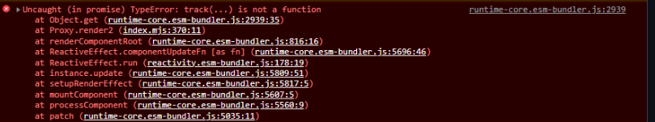
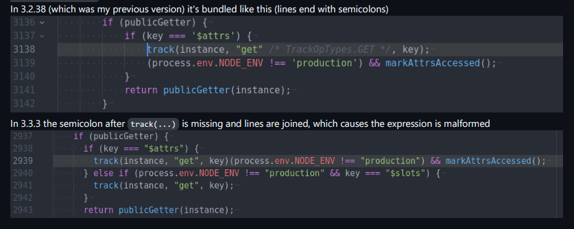
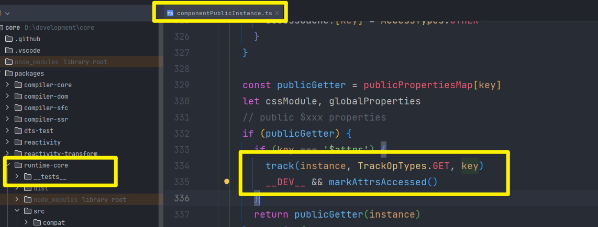
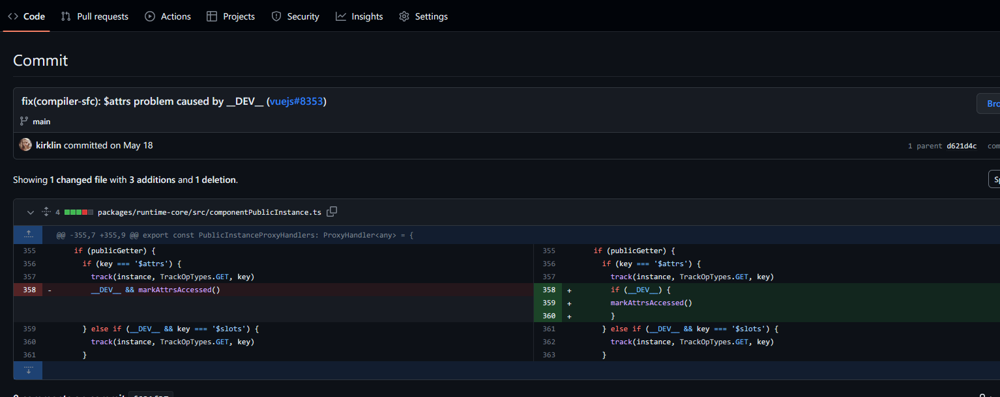
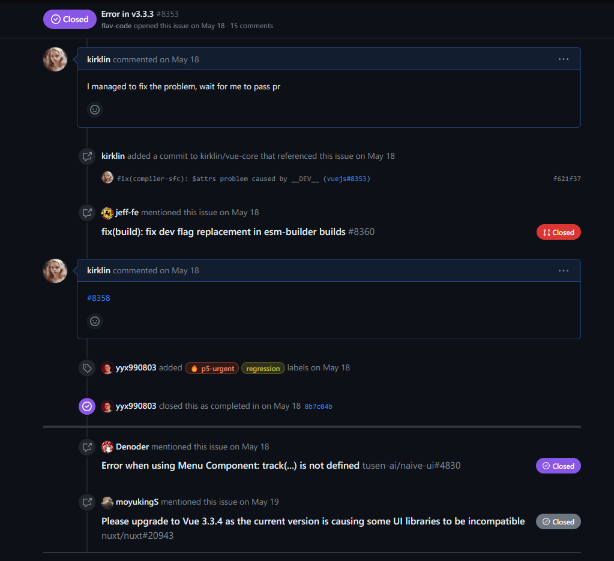
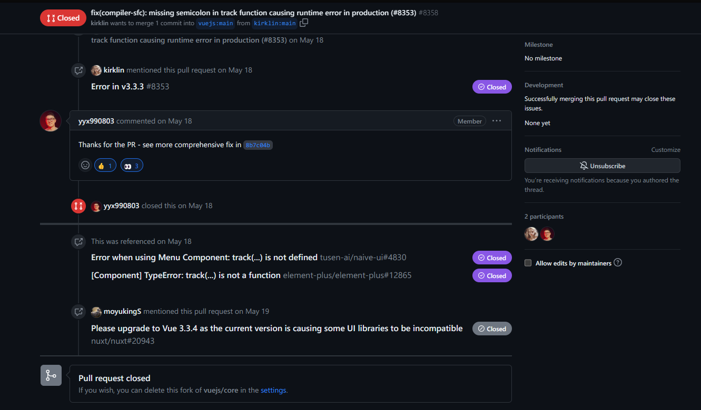
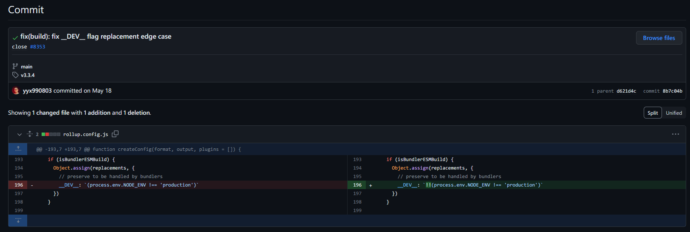

在这篇文章中，我将记录我在使用Vue 3.3.3版本时遇到的p5-urgent级bug的修复过程。这个问题导致项目启动时出现白屏，为了解决它，我经历了一系列排查、搜索和代码修复过程。

## 起因
因为项目需要使用Vue3的新特性，所以我们决定升级Vue的依赖版本。然而，在刚启动项目后，上来直接遇到了一个报错导致了启动白屏。首先，我们排查了可能是由兼容性问题引起的，但经过一番操作后，发现问题并不是由此引起的。于是，我们决定去GitHub的Issue页面搜索一下，看看是否有其他人也遇到了类似的问题。

## 定位问题
果然，通过搜索，我们很快就在[Vue.js的GitHub仓库](https://github.com/vuejs/core)上找到了对应的Issue：[Error in v3.3.3 · Issue #8353](https://github.com/vuejs/core/issues/8353)

看了一眼这个bug，很多人都能够复现这个bug，并且影响范围非常广泛，这让我立马就来了兴致，想看看是什么原因引起的。毕竟以前从来没有遇到过vue发生这么严重的问题。

通过浏览器打印的堆栈信息，很快就定位到了报错的地方，编译后的结果在track函数后少了一个分号，导致函数调用的中间有两组括号。在正常情况下，函数调用应该只有一个括号对，用于传递参数。

## 修复过程
接着，我打开了WebStorm，定位到了编译前的代码，从代码写法上来看，找不到任何问题，所以判断问题似乎是由编译后的代码引起的，我想到了一个可能的解决方案：修改`__DEV__`的写法，以便正确打包出代码并解决这个问题。

通过将 `__DEV__ && markAttrsAccessed()` 改为 `if (__DEV__) { markAttrsAccessed() }`，成功地解决了在Vue 3.3.3版本中出现的编译后问题。这样的修改确保了在开发环境下执行 `markAttrsAccessed()` 函数，而在生产环境中则不执行，避免了问题。

于是我决定提交一个PR：[fix(compiler-sfc): missing semicolon in track function causing runtime error in production (#8353) by kirklin · Pull Request #8358 · vuejs/core (github.com)](https://github.com/vuejs/core/pull/8358)

## 更好的解决方案
大约一个小时后，尤雨溪给了一个更好的解决方案： 在`rollup.config.js`中对`__DEV__: (process.env.NODE_ENV !== 'production')`进行修改为`__DEV__: !!(process.env.NODE_ENV !== 'production')`，这是一个小但重要的修改。
添加双重感叹号（`!!`）确保`__DEV__`标志始终是布尔值（`true`或`false`）。这个改动不会对原本打包后的代码产生影响，但有助于保持一致性，即使在分号自动插入机制可能导致问题的情况下，也能确保在构建过程中该标志的值始终正确设置。

大佬就是大佬，这才是真的从编译上解决了问题！！
